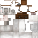

# Donkey Variations

This is a minecraft Resource Pack that adds variations to the Minecraft donkey mob.

This resource pack requires Minecraft 1.21.10+ and the [Entity Texture Features](https://modrinth.com/mod/entitytexturefeatures) mod. It may also work with Optifine, but has not been tested.

## Examples

Vanilla:

Gray hue:

